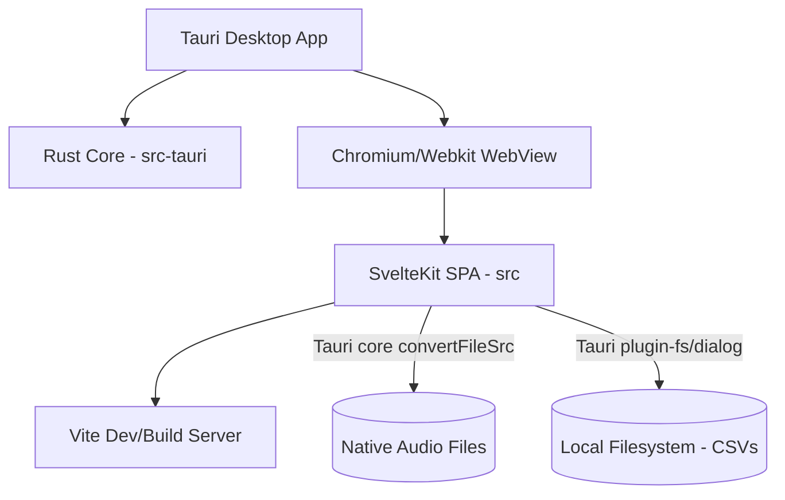

# System Architecture & Platform Implementation

This document describes the current platform implementation, build system, backend/frontend relationship, and data architectures of the Verbatim UI project.

---

## 🛠️ Technology Stack & Core Infrastructure

The project is structured as a cross-platform desktop application using the **Tauri v2** framework shell and a single-page frontend application built with **Svelte 5** (utilizing SvelteKit in static SPA mode) and **Vite**.

### 1. Build and Bundling Flow
*   **Vite**: Configured in [vite.config.js](file:///home/bit/Playground/verbatim-ui/vite.config.js) to compile Svelte components, handle imports, and bundle static assets. It ignores watching `src-tauri` changes to prevent infinite dev-server reloads.
*   **SvelteKit Static Adapter**: Pre-renders the frontend into static HTML, CSS, and JS. The configuration in [svelte.config.js](file:///home/bit/Playground/verbatim-ui/svelte.config.js) outputs static files directly to `/build`.
*   **Tauri Config**: Configured in [tauri.conf.json](file:///home/bit/Playground/verbatim-ui/src-tauri/tauri.conf.json) to read the frontend assets from `"frontendDist": "../build"` during build, and point to `"devUrl": "http://localhost:1420"` in local development mode.

---

## 🏗️ Architecture Design & Components

### 1. Frontend-Backend Boundary
The relationship between the Rust backend (`src-tauri`) and the Webview frontend (`src`) is structured as follows:
*   **Rust Shell**: The backend ([src-tauri/src/lib.rs](file:///home/bit/Playground/verbatim-ui/src-tauri/src/lib.rs)) instantiates the application window, registers official plugins (`tauri-plugin-opener`, `tauri-plugin-dialog`, `tauri-plugin-fs`), and exposes an unused `load_csv_data` command.
*   **Tauri Plugins Access**: The frontend bypasses custom IPC commands and invokes the host OS directly using Tauri v2 JavaScript client APIs:
    *   `@tauri-apps/plugin-dialog` to launch native OS Open/Save file dialogues.
    *   `@tauri-apps/plugin-fs` to perform direct file reading and writing of CSV transcriptions.
    *   `getCurrentWindow().onFileDropEvent` to handle native OS drag-and-drop operations for `.csv` and audio files.

### 2. State & Data Flow
All runtime data is managed via Svelte 5 context injection and reactive runes:
*   **Context Store (`TRANSCRIPT_STATE`)**: The application instantiates a centralized `TranscriptState` class (from [transcript.svelte.js](file:///home/bit/Playground/verbatim-ui/src/lib/state/transcript.svelte.js)) in the root [+page.svelte](file:///home/bit/Playground/verbatim-ui/src/routes/+page.svelte) and registers it in Svelte's context. Subcomponents query this context to retrieve and alter states.
*   **Runes**: Reactive properties (`words`, `activeWordIndex`, `audioCurrentTime`, `showUnderlines`, etc.) are declared using the `$state` rune, while computed arrays like `sentenceGroups` and `speakers` utilize `$derived`.
*   **History Stack (`history`)**: The store maintains a history stack of the `words` array. Undoing and redoing is handled by swapping active array values back to historical snapshots.
*   **Virtualized Table View**: Large transcripts can feature thousands of rows. The [VirtualTable.svelte](file:///home/bit/Playground/verbatim-ui/src/lib/VirtualTable.svelte) component virtually scrolls the word arrays, rendering only the rows within the viewport buffer (plus padding) to maintain rendering speeds.

---

## 🔊 Audio Engine

The application streams audio efficiently without fully loading files into RAM:
1.  **Native File Conversion**: Local audio files loaded via native dialogues or file drops are converted to a webview-accessible URL using Tauri's native core `convertFileSrc`.
2.  **HTML5 Streaming**: An HTML5 `<audio>` element (instantiated in the store constructor) streams the audio content.
3.  **Waveform Integration**: A `wavesurfer.js` instance in [AudioPlayer.svelte](file:///home/bit/Playground/verbatim-ui/src/lib/components/AudioPlayer.svelte) binds directly to the HTML5 `<audio>` media node, drawing the waveform and monitoring playback progress natively.
4.  **Time Synchronization**: An animation frame loop (`requestAnimationFrame`) in the store polls the elapsed playback time from the `<audio>` element. When the time falls within a word's start and end timestamps, `activeWordIndex` is updated, prompting automatic smooth-scrolling to bring the active word bubble into view.

---

## ⚠️ Architectural Constraints & Bottlenecks

*   **State Cloning Overhead**: The undo/redo history clones the entire `words` array for every state snapshot, which is memory-intensive for large files.
*   **Caret Focus Issues**: Dynamic text-binding inside contenteditable elements (`bind:textContent`) causes caret jumping during typing syncs.
*   **Lack of Validation**: The ASR CSV importer expects exact headers (`word`, `start`, `end`, `score`, `speaker`) but lacks robust validation checking. Missing headers or bad rows will crash the parser.
*   **Waveform Re-render Leaks**: Instantiating and destroying WaveSurfer dynamically can leak canvas elements if the target container node is not cleared.
