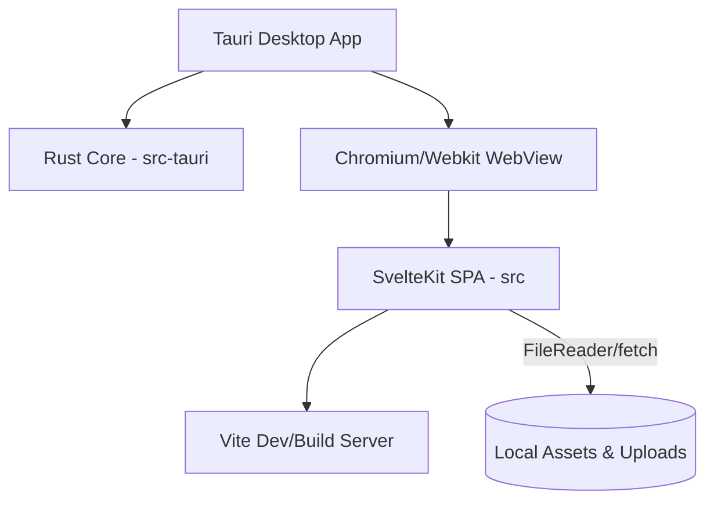

# System Architecture & Platform Implementation

This document describes the current platform implementation, build system, backend/frontend relationship, and data architectures of the Verbatim UI project.

---

## 🛠️ Technology Stack & Core Infrastructure

The project is structured as a cross-platform desktop application using the **Tauri v2** framework shell and a single-page frontend application built with **Svelte 5** (utilizing SvelteKit in static SPA mode) and **Vite**.



### 1. Build and Bundling Flow
*   **Vite**: Configured in [vite.config.js](file:///home/bit/Playground/verbatim-ui/vite.config.js) to compile Svelte components, handle imports, and bundle static assets. It ignores watching `src-tauri` changes to prevent infinite dev-server reloads.
*   **SvelteKit Static Adapter**: Pre-renders the frontend into purely static HTML, CSS, and JS. The configuration in [svelte.config.js](file:///home/bit/Playground/verbatim-ui/svelte.config.js) outputs static files directly to `/build`.
*   **Tauri Config**: Configured in [tauri.conf.json](file:///home/bit/Playground/verbatim-ui/src-tauri/tauri.conf.json) to read the frontend assets from `"frontendDist": "../build"` during build, and point to `"devUrl": "http://localhost:1420"` in local development mode.

---

## 🏗️ Architecture Design & Components

### 1. Current Frontend-Backend Boundary
At present, the relationship between the Rust backend (`src-tauri`) and the Webview frontend (`src`) is decoupled:
*   **Rust Shell**: The backend initiates the default desktop window shell and sets up an unused RPC command handler `load_csv_data` in [lib.rs](file:///home/bit/Playground/verbatim-ui/src-tauri/src/lib.rs).
*   **Browser-Sandbox Engine**: The Svelte application executes entirely in the WebView sandbox without invoking native Tauri APIs. File loading and downloads bypass Tauri shell plugins, using HTML5 file elements and Blob downloads instead.

### 2. State & Data Flow
All runtime data is managed locally inside Svelte's memory space in [+page.svelte](file:///home/bit/Playground/verbatim-ui/src/routes/+page.svelte):

*   **Words Array (`words`)**: A flat list of object items holding information for each word in the transcript:
    ```javascript
    {
      id: "unique-str-id",
      word: "text",
      start: "1.02", // start time in seconds
      end: "1.54",   // end time in seconds
      score: "0.89", // ASR confidence rating
      speaker: "SPEAKER_01"
    }
    ```
*   **Sentence Groups (`sentenceGroups`)**: A derived structure computed reactively when `words` changes. It groups sequential words spoken by the same speaker so they can be grouped into paragraph blocks:
    ```javascript
    $: sentenceGroups = words.reduce(...)
    ```
*   **History Stack (`history`)**: An array of deep-copied transcription states. Changes are saved using serialized state strings (`JSON.stringify`) to support multi-level Undo/Redo.

---

## 🔊 Audio Engine

The application processes audio natively inside the web thread using the **Web Audio API**:
1.  A user selects an audio file, or a default file is fetched.
2.  The audio file is converted to an `ArrayBuffer` and decoded via `audioCtx.decodeAudioData`.
3.  The uncompressed PCM data is stored in `audioBuffer`.
4.  Playback triggers an `AudioBufferSourceNode` connected to a `GainNode`.
5.  An animation frame loop (`requestAnimationFrame`) polls the elapsed playback time, setting the `audioCurrentTime` state which is cross-referenced with word timestamps to highlight active elements in real time.

---

## ⚠️ Architectural Constraints & Bottlenecks

*   **Memory Exhaustion**: Decoding raw audio into in-memory PCM buffers blocks memory and does not scale to large multi-hour transcriptions.
*   **Keystroke Performance**: Deep-cloning the entire transcript array during inline edits triggers DOM rerendering, leading to input latency for larger files.
*   **Desktop Isolation**: The lack of native filesystem access prevents standard file dialog integration and limits the app to operating inside typical browser sandbox constraints.
